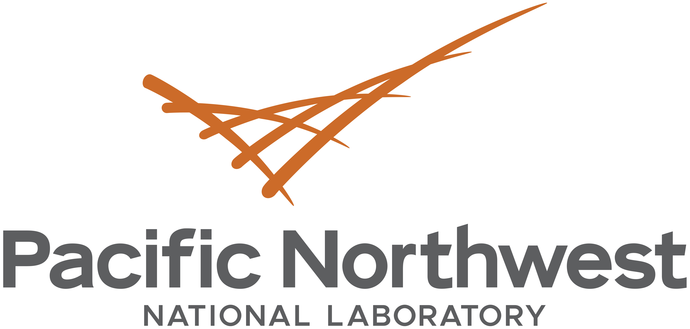

# PTM-Psi

<p align="center">
 &emsp;

</p>

<br /><br />

[](https://opensource.org/licenses/BSD-3-Clause)
[](https://www.python.org)
[](#PTM-Psi)


## Overview

*PTM-Psi* is a Python Package to Facilitate the Computational Investigation of Post-Translational Modification on Protein Structures and Their Impacts on Dynamics and Functions. 

## Installation

### Virtual Environment

The following instructions can be used to install *PTM-Psi* a virtual environment in editable mode. In this way, updates pulled from the repository will become available without the need to reinstall the package.

```bash
python -m venv ptmpsi
source ptmpsi/bin/activate
pip install --upgrade pip

git clone https://github.com/pnnl/PTMPSI.git
cd PTMPSI
pip install -e .
```

### Navigate to ptmpsi–PCA analysis module
This module provides scripts and workflows for performing Principal Component Analysis (PCA) on molecular dynamics (MD) simulations within the PTMPSI framework. It supports feature extraction, PCA computation, clustering, scoring, and figure generation, producing both per-system and combined results.
```
cd PTMPSI/ptmpsi-PCA
   ```
**Run the setup script** to prepare the environment and required directories:
```bash
bash setup.sh
conda activate gppenv
```
**Generate MD pipelines** using your configuration:
```bash
python generate_pipelines.py
# CLI options—enter the path to <RAWsimulations_DIR>, <REFerence_DIR>, <POSTprocess_dir>
```
**Navigate to the generated workflow directory** and run the MD jobs:
```bash
cd <generated_workflow_dir>
bash md_bundle_flux.sh
```
---

## 📂 Output

- **Per-system results** in respective system directories
- **Combined PCA results** in `PC_score_ranking.csv` and `combined_score_ranking.csv`
- **Figures**: RMSD, Rg, RMSF, contact maps, PCA scatter plots

---
## Citation

## License

*PTM-Psi* is made freely available under the terms of a modified 3-clause BSD license. See [LICENSE](./LICENSE) for details.

## Acknowledgments

The development of *PTM-Psi* is part of the Predictive Phenomics Initiative at the Pacific Northwest National Laboratory (PNNL). Also, a portion of the research was performed using the Molecular Sciences Computing Facility (Tahoma) at the Environmental Molecular Sciences Laboratory (EMSL) and using resources available through Research Computing at PNNL. It was conducted under the Laboratory Directed Research and Development Program at PNNL. PNNL is a multi-program national laboratory operated by Battelle Memorial Institute for the U.S. Department of Energy under contract DE-AC05-76RL01830.
